# Red Social - DOGGOS
Autoras (Ana - Marlene - Roxsy)

## Índice

* [1. Tema](#1-Tema)
* [2. Introducción](#2-Introducción)
* [3. Definición del producto](#3-Definición-del-producto)
* [4. Investigación UX](#4-Investigación-UX)
* [5. Diseño de interfaz de usuario UI](#5-Diseño-de-interfaz-de-usuario-UI)
* [6. Mocks y Test](#6Mocks-y-test)
* [7. Entrega](#7-entrega)

## 1. Tema

Aplicación web, responsive y SPA con FIREBASE, sobre una red social para dueños de perros.

## 2. Introducción

El perro es un animal muy apreciado por su compañia, lealtad y afecto. Por ello, cada vez más familias suman a su hogar un perrito.
Esto esta haciendo que la comunidad dog lovers incremente, necesitando medios para poder interactuar.

## 3. Definición del producto
 
Luego de una serie de investigaciones y estudios, llegamos a la conclusión de que existía una gran necesidad en la comunidad de dueños de perros de tener un espacio en línea donde pudieran conectarse entre sí y compartir sus experiencias. Además, notamos que muchas personas buscaban un lugar donde pudieran encontrar información útil y recursos relacionados con la crianza y cuidado de sus perros. Por estas razones, decidimos desarrollar Doggos, una red social exclusiva para dueños de perros, con el objetivo de brindarles una plataforma donde puedan conectarse, compartir y aprender juntos. Estamos seguros de que Doggos será un gran éxito entre los amantes de los perros, y esperamos poder brindarles un servicio valioso y útil a lo largo del tiempo.

### Objetivos del proyecto Doggos:

--Desarrollar una Single Page Application (SPA) con temática de red social para dueños de perros.
--Aplicar los conceptos de responsividad en el desarrollo de las vistas (templates) para garantizar una buena experiencia de usuario en dispositivos móviles.
--Implementar un router para la navegación entre las diferentes vistas de la aplicación, lo que permitirá una mejor organización del código y una navegación más intuitiva para los usuarios.
--Emplear un servicio externo para la persistencia de datos de la aplicación(FIREBASE), lo que permitirá almacenar información de los usuarios y sus perros de manera segura y escalable.
--Crear una suite de pruebas  que permitan testear código lo que garantizará la estabilidad y confiabilidad de la aplicación.

## 4. Investigación UX
En esta sección, presentaremos las historias de usuario de nuestra aplicación, las cuales ilustran cómo nuestra plataforma ayudará a los usuarios a conectarse y compartir sus experiencias con otros amantes de los perros. Estas historias de usuario son una muestra de las funcionalidades y beneficios que ofrecerá nuestra aplicación, diseñadas para mejorar la experiencia del usuario y ayudarles a conectarse con otros amantes de los perros.

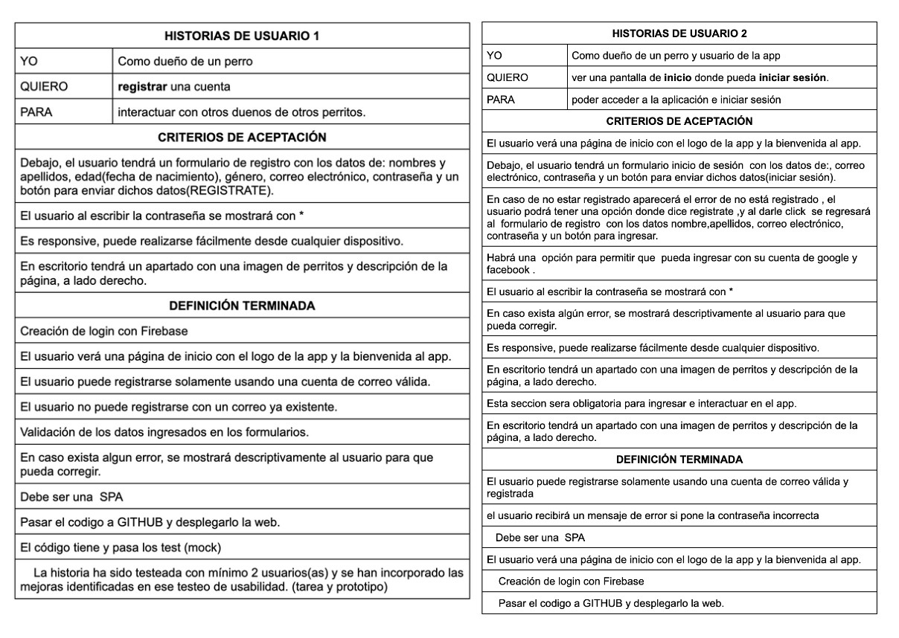
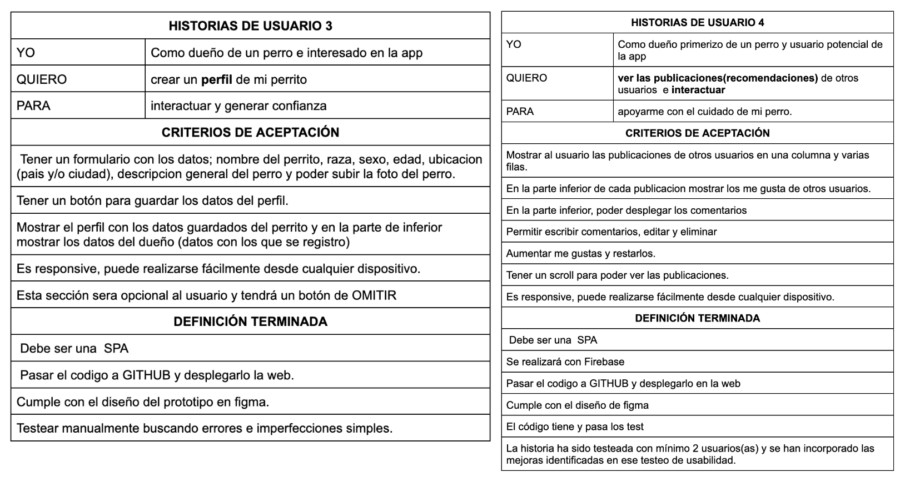
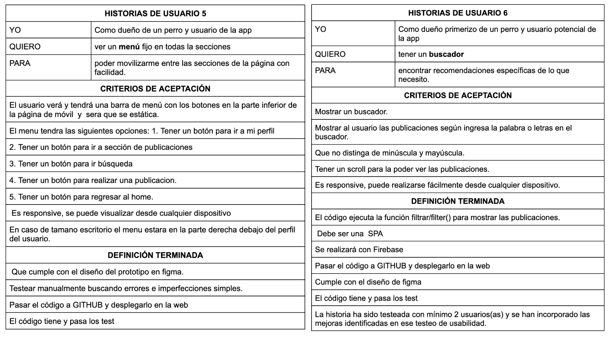
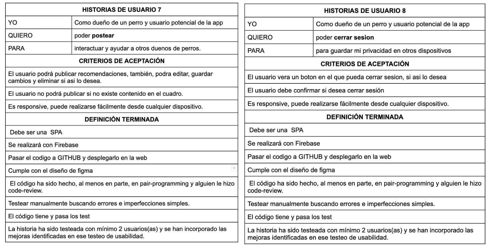

## 5. Diseño de interfaz de usuario UI

En esta sección se presenta los prototipos de baja y alta fidelidad que se crearon para la aplicación Doggos. Estos prototipos fueron desarrollados en Figma y fueron un paso crucial en el proceso de diseño, ya que nos permitieron visualizar y perfeccionar la experiencia de usuario antes de comenzar el desarrollo de la aplicación final. A través de la iteración y el feedback de los usuarios, se logró un diseño intuitivo y fácil de usar que se adapta a las necesidades de nuestra audiencia objetivo. En esta sección se mostrará cómo evolucionó el diseño a lo largo del proceso y cómo se llegó al diseño final.

### Prototipo de Baja fidelidad

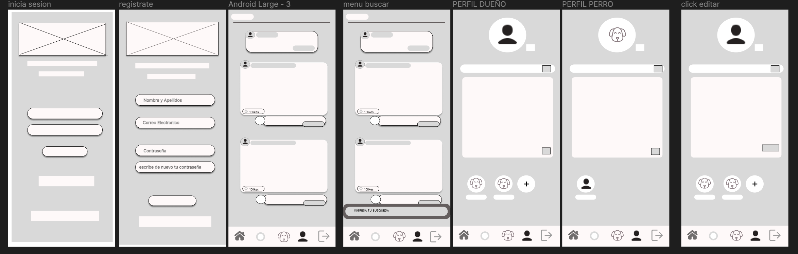
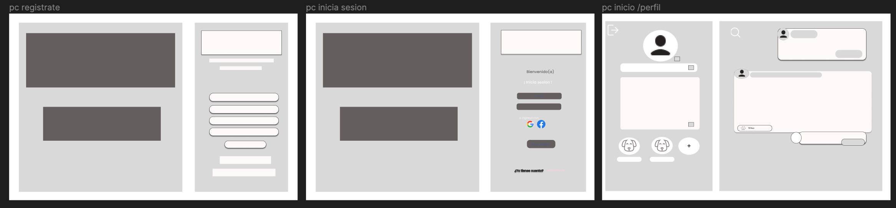

### Prototipo de Alta fidelidad

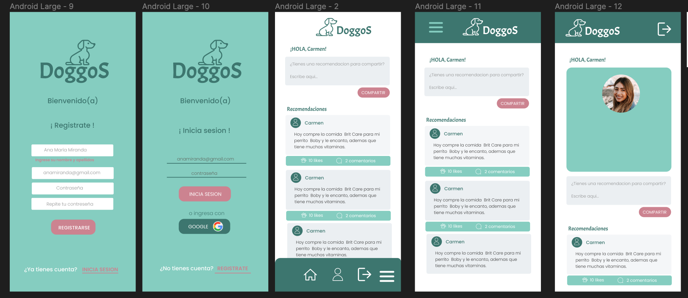
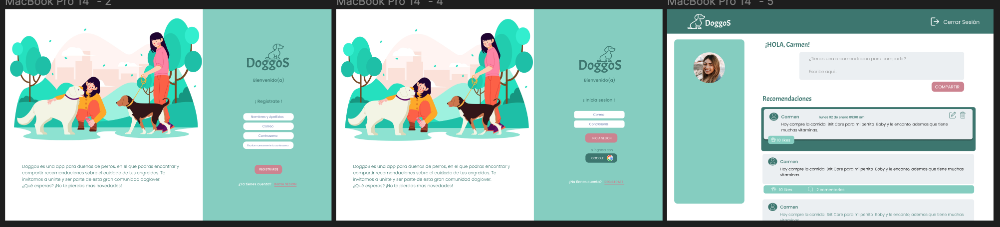

## 6. Mocks y Test

Se realizo mocks de las funciones de autentificación de firebase y firestore utilizadas en el proyecto. Como signInWithEmailAndPassword, createEmailAndPassword,  addDoc, getDocs, deleteDoc, getDoc, updateDoc, entre otros.
Se realizo los test unitarios de las funciones creadas por nosotras, logrando cubrir el 
 _ 90% functions_ _90% lines_ _90% statements_  _100% branches_. Cumpliendo con los % requeridos.

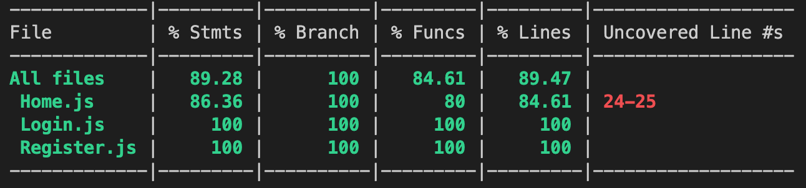

## 7. Entrega

Se concluyó el proyecto subiendo el código a GitHub y la interfaz de despliegue usando el servicio de hosting en Netlify.
Sin embargo, se hizo una refactorización en cuanto a las historias de usuario y el diseño final. 
Esto se debió al tiempo limitado que se contaba, por lo tanto, tomamos la decisión de dejarlo de la siguiente manera.

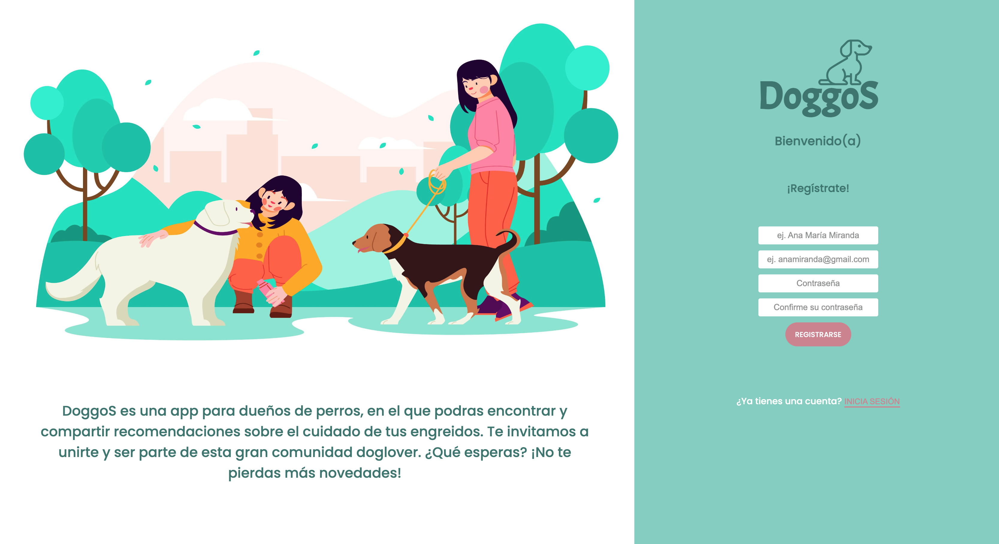
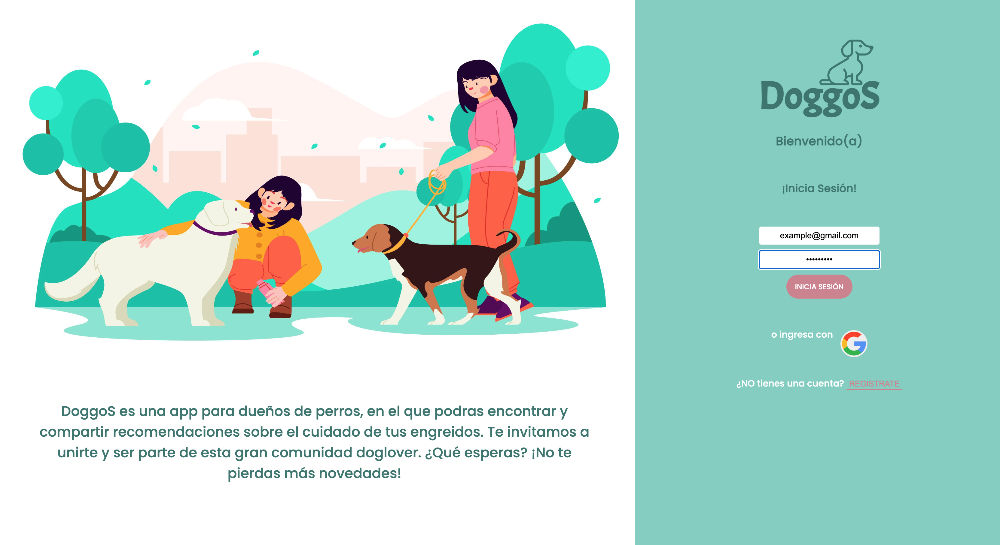
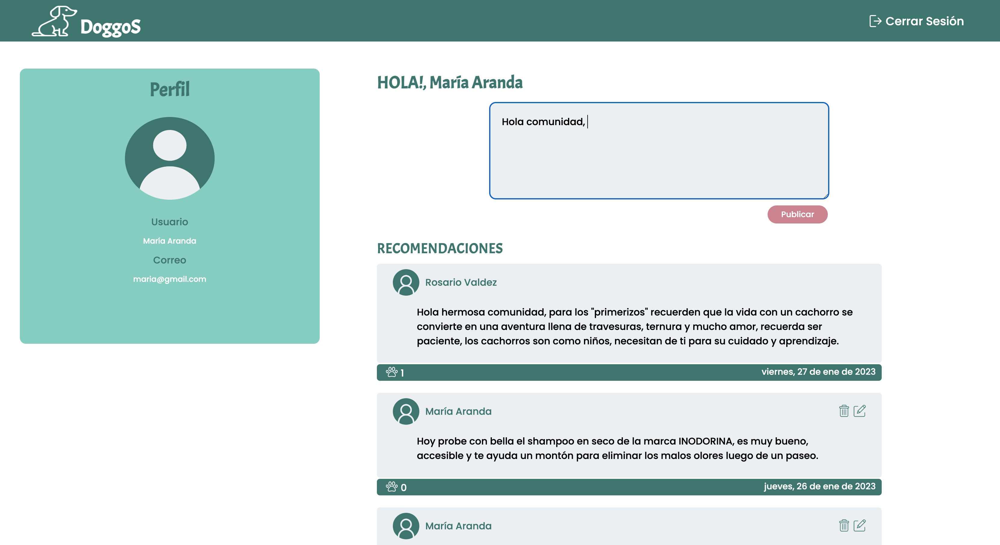

